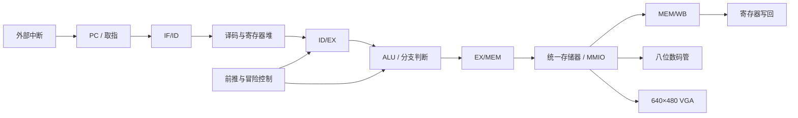

# RV32I 五级流水线 CPU 与 FPGA 外设系统

基于 Verilog 与 Vivado 实现的 32 位 RISC-V 处理器，采用经典 IF、ID、EX、MEM、WB 五级流水线，支持 31 条 RV32I 指令，并集成外部中断、统一存储器、按钮、八位数码管和 VGA 显示等板级外设。

> 仓库是从原 Vivado 工程提取的可读源码与验证记录，不包含工程缓存、IP 生成物、比特流和完整初始化文件。请先阅读“工程恢复说明”，不要将当前归档视为开箱即用的板级工程。

## 系统架构



## CPU 核心

- **五级流水线**：在 `cpu.v` 中维护 IF/ID、ID/EX、EX/MEM、MEM/WB 四组流水寄存器。
- **指令覆盖**：实现算术、逻辑、移位、比较、访存、条件分支、跳转和高位立即数等 31 条 RV32I 指令。
- **数据相关处理**：通过 EX/MEM、MEM/WB 前推减少 RAW 冒险停顿；Load-Use 相关插入一个周期气泡。
- **控制相关处理**：采用静态默认不跳转策略，分支或跳转成立时重定向 PC 并冲刷错误路径指令。
- **外部中断**：保存控制流并转入中断入口，配合汇编程序验证外设事件响应。
- **统一地址空间**：指令、数据、栈、中断入口和 MMIO 由统一存储器模块完成地址译码。

## 板级外设

| 模块 | 实现 |
| --- | --- |
| 按钮输入 | 时钟同步与消抖，作为外部控制/中断输入 |
| 数码管 | 八位动态扫描，支持三种数据显示模式 |
| VGA | 640×480@60 Hz 时序，无帧缓冲图形输出 |
| 存储器映射 I/O | 将外设寄存器映射到 `0x80000000` 起始的 I/O 地址区间 |
| 调试 | 保留 ILA 接入位置及模块级 testbench |

## 目录结构

```text
.
├── rtl/            # CPU、控制器、ALU、寄存器堆、存储器与外设 RTL
├── asm/            # 中断、数码管和综合验证汇编程序
├── sim/            # CPU、消抖、数码管和 VGA testbench
└── constraints/    # 开发板时钟与引脚约束示例
```

## 验证链路

1. 使用模块级 testbench 检查时钟/复位、按钮消抖、数码管扫描和 VGA 时序。
2. 将汇编测试程序转换为存储器初始化文件，验证算术、访存、分支和中断控制流。
3. 在 Vivado 行为仿真中观察流水寄存器、前推选择、停顿和冲刷信号。
4. 综合并下载至 FPGA，通过按钮、数码管、VGA 及 ILA 完成板级联调。

仓库中的 `asm/` 保留了 `seven_segment_test.asm`、分级综合测试和 `Interruption_device.asm` 等原始测试程序。

## 工程恢复说明

1. 在 Vivado 中新建 RTL 工程，添加 `rtl/`、`sim/` 和目标开发板对应的约束文件。
2. 从原工程恢复被各模块引用的 `macro.vh`，其中应包含 RV32I 操作码、ALU/分支控制以及内存地址宏定义。
3. 生成汇编程序对应的十六进制初始化文件，并修改 `unified_mem.v` 中原开发机的绝对文件路径。
4. 根据实际开发板核对时钟、复位、按钮、数码管和 VGA 引脚；先完成行为仿真，再综合实现。

当前公开归档未包含第 2、3 步所需的完整工程文件，因此不对直接综合成功作出承诺。

## 个人工作与协作边界

该系统由团队协作完成五级流水线、数据前推、Load-Use 停顿、静态分支处理与中断联调。本人主要负责内存映射外设、汇编测试程序和板级验证，实现按钮消抖、三模式八位数码管及 640×480@60 Hz 无帧缓冲 VGA 显示，并参与 CPU 与外设的系统联调。
